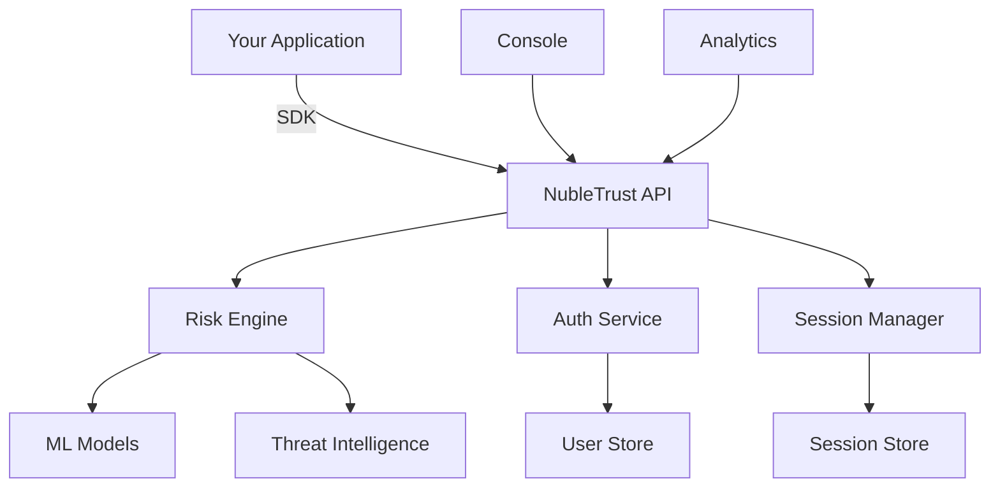

# 🛡️ NubleTrust

**Zero Trust Authentication-as-a-Service**

Build secure applications with continuous risk assessment and intelligent access control. NubleTrust provides modern authentication with built-in security intelligence, so you can focus on building great products.

<div align="center">


[](https://badge.fury.io/js/@nubletrust%2Fsdk)
[](https://opensource.org/licenses/MIT)
[](https://www.typescriptlang.org/)
[](https://vercel.com/new/clone?repository-url=https://github.com/nubletrust/nubletrust)

[🚀 Get Started](#getting-started) • [📖 Documentation](https://docs.nubletrust.com) • [🎮 Live Demo](https://demo.nubletrust.com) • [💬 Discord](https://discord.gg/nubletrust)

</div>

---

## ✨ Why NubleTrust?

Traditional authentication is binary: users are either "in" or "out". NubleTrust brings **continuous security** to your applications with real-time risk assessment and adaptive access control.

### 🔥 Key Features

- **🎯 Zero Trust by Design** - Never trust, always verify with continuous authentication
- **🧠 Intelligent Risk Scoring** - ML-powered behavioral analysis and threat detection  
- **⚡ Developer-First** - Simple SDK, extensive docs, works with any framework
- **🌐 Multi-Tenant Ready** - Built for SaaS applications from day one
- **📊 Real-time Analytics** - Comprehensive security insights and threat monitoring
- **🔧 Highly Customizable** - Flexible policies, custom risk factors, and workflows

---

## 🚀 Getting Started

Get up and running with NubleTrust in under 5 minutes.

### 1. Create Your Account

```bash
npx create-nubletrust-app my-secure-app
cd my-secure-app
```

Or visit [console.nubletrust.com](https://console.nubletrust.com) to create your first application.

### 2. Install the SDK

```bash
npm install @nubletrust/sdk
# or
yarn add @nubletrust/sdk
# or  
pnpm add @nubletrust/sdk
```

### 3. Initialize NubleTrust

```typescript
import { NubleTrust } from '@nubletrust/sdk';

const auth = new NubleTrust({
  apiKey: process.env.NUBLETRUST_API_KEY,
  appId: process.env.NUBLETRUST_APP_ID
});
```

### 4. Add Authentication

```typescript
// Sign up new users
const { user, session } = await auth.signUp('user@example.com', 'password123');

// Sign in with risk assessment
const result = await auth.signIn('user@example.com', 'password123', {
  deviceFingerprint: await auth.getDeviceFingerprint(),
  location: await auth.getLocation()
});

if (result.riskScore > 70) {
  // Handle high-risk login
  await auth.challengeUser('email');
}
```

---

## 🎯 Quick Examples

### React Authentication Hook

```jsx
import { useNubleTrust } from '@nubletrust/react';

function LoginForm() {
  const { signIn, user, loading } = useNubleTrust();

  const handleLogin = async (email, password) => {
    try {
      await signIn(email, password);
      // User is now authenticated with risk assessment
    } catch (error) {
      console.error('Login failed:', error.message);
    }
  };

  if (loading) return <div>Loading...</div>;
  if (user) return <div>Welcome, {user.email}!</div>;

  return (
    <form onSubmit={handleLogin}>
      {/* Your login form */}
    </form>
  );
}
```

### Next.js API Route Protection

```typescript
import { withNubleTrust } from '@nubletrust/nextjs';

export default withNubleTrust(async (req, res) => {
  // This route is now protected with continuous risk assessment
  const { user, riskScore } = req.nubleTrust;
  
  if (riskScore > 80) {
    return res.status(403).json({ error: 'Access denied - high risk detected' });
  }

  res.json({ message: `Hello ${user.email}, your risk score is ${riskScore}` });
}, {
  requireAuth: true,
  maxRiskScore: 90
});
```

### Real-time Risk Monitoring

```typescript
// Monitor user sessions in real-time
auth.onRiskChange((riskData) => {
  console.log('Risk score updated:', riskData.score);
  
  if (riskData.score > 85) {
    // Trigger additional security measures
    showSecurityWarning();
    requireStepUpAuth();
  }
});
```

---

## 🏗️ Architecture

NubleTrust is built on a modern, scalable architecture designed for high availability and security.



### Core Components

- **🔐 Authentication Service** - Secure user management with modern protocols
- **🧮 Risk Engine** - Real-time behavioral analysis and threat detection
- **📊 Session Manager** - Intelligent session handling with automatic risk updates
- **🎛️ Developer Console** - Comprehensive management and analytics dashboard
- **📱 Multi-platform SDKs** - Native support for web, mobile, and server environments

---

## 📊 Security Intelligence

### Risk Factors We Monitor

| Factor | Description | Risk Impact |
|--------|-------------|-------------|
| 🌍 **Location Anomalies** | Unusual geographic access patterns | High |
| ⏰ **Temporal Patterns** | Access outside normal hours/patterns | Medium |
| 🖥️ **Device Fingerprinting** | Unknown or suspicious devices | High |
| 🌐 **Network Analysis** | VPN, Tor, suspicious IP ranges | Medium |
| 🎯 **Behavioral Biometrics** | Typing patterns, mouse movements | Low |
| 🔄 **Session Patterns** | Unusual session duration or activity | Medium |

### Adaptive Responses

```typescript
// Configure intelligent responses based on risk levels
auth.configure({
  riskThresholds: {
    low: 0,      // 🟢 Normal access
    medium: 40,  // 🟡 Additional logging
    high: 70,    // 🟠 Step-up authentication
    critical: 90 // 🔴 Block access
  },
  responses: {
    medium: ['log', 'notify'],
    high: ['mfa', 'email_alert'],
    critical: ['block', 'admin_alert']
  }
});
```

---

## 🛠️ Framework Support

NubleTrust works seamlessly with your favorite tools and frameworks.

<div align="center">

| Framework | Package | Status |
|-----------|---------|---------|
| **React** | `@nubletrust/react` | ✅ Stable |
| **Next.js** | `@nubletrust/nextjs` | ✅ Stable |
| **Vue.js** | `@nubletrust/vue` |  📅 Planned |
| **Nuxt** | `@nubletrust/nuxt` | 📅 Planned |
| **Svelte** | `@nubletrust/svelte` | 📅 Planned |
| **Node.js** | `@nubletrust/node` | 🚧 Beta |
| **Python** | `nubletrust-python` | 📅 Planned |

</div>

---

## 🌟 What Developers Are Saying

> *"NubleTrust transformed our security posture overnight. The risk-based authentication caught 3 account takeover attempts in the first week!"*
> 
> **— Sarah Chen, CTO @ TechFlow**

> *"Implementation took 30 minutes. The SDK is incredibly well-designed and the documentation is top-notch."*
> 
> **— Marcus Rodriguez, Lead Developer @ DataVault**

> *"Finally, authentication that gets smarter over time. Our security team loves the real-time insights."*
> 
> **— Jennifer Park, Security Engineer @ CloudScale**

---

## 🤝 Contributing

We welcome contributions! Whether it's bug reports, feature requests, or code contributions.

- 🐛 [Report Issues](https://github.com/nubletrust/nubletrust/issues)
- 💡 [Request Features](https://github.com/nubletrust/nubletrust/discussions)
- 📝 [Improve Documentation](https://github.com/nubletrust/docs)
- 🔧 [Submit Pull Requests](https://github.com/nubletrust/nubletrust/pulls)

### Development Setup

```bash
git clone https://github.com/nubletrust/nubletrust.git
cd nubletrust
npm install
npm run dev
```

---

## 🛡️ Security & Compliance

Security is our top priority. NubleTrust is built with enterprise-grade security standards.

- **🔒 SOC 2 Type II** - Independently audited security controls
- **🏛️ GDPR Compliant** - Privacy by design with data protection
- **🛡️ ISO 27001** - International security management standards
- **⚡ 99.99% Uptime** - Highly available with global redundancy
- **🔐 End-to-End Encryption** - All data encrypted in transit and at rest

### Bug Bounty Program

Help us keep NubleTrust secure. Report security vulnerabilities to [security@nubletrust.com](mailto:security@nubletrust.com) and earn rewards up to **$10,000**.

---

## 📚 Resources

- 📖 [Documentation](https://docs.nubletrust.com)
- 🎓 [Tutorials](https://docs.nubletrust.com/tutorials)
- 🎮 [Interactive Playground](https://playground.nubletrust.com)
- 📺 [Video Guides](https://youtube.com/@nubletrust)
- 📋 [Migration Guides](https://docs.nubletrust.com/migrate)
- 🗣️ [Community Forum](https://community.nubletrust.com)

---

## 📞 Support

Need help? We're here for you.

- 💬 [Discord Community](https://discord.gg/nubletrust)
- 📧 [Email Support](mailto:support@nubletrust.com)
- 📋 [Support Center](https://support.nubletrust.com)
- 🐛 [GitHub Issues](https://github.com/nubletrust/nubletrust/issues)

**Enterprise customers get:**
- 📞 24/7 Phone Support
- 👥 Dedicated Success Manager  
- 🚀 Priority Feature Requests
- 🎯 Custom Integration Support

---

<div align="center">

**Built with ❤️ by the NubleTrust Team**

[Website](https://nubletrust.com) • [Twitter](https://twitter.com/nubletrust) • [LinkedIn](https://linkedin.com/company/nubletrust) • [GitHub](https://github.com/nubletrust)

---

*Start building secure applications today. Your users' security can't wait.*

**[🚀 Get Started for Free](https://console.nubletrust.com/signup)**

</div>